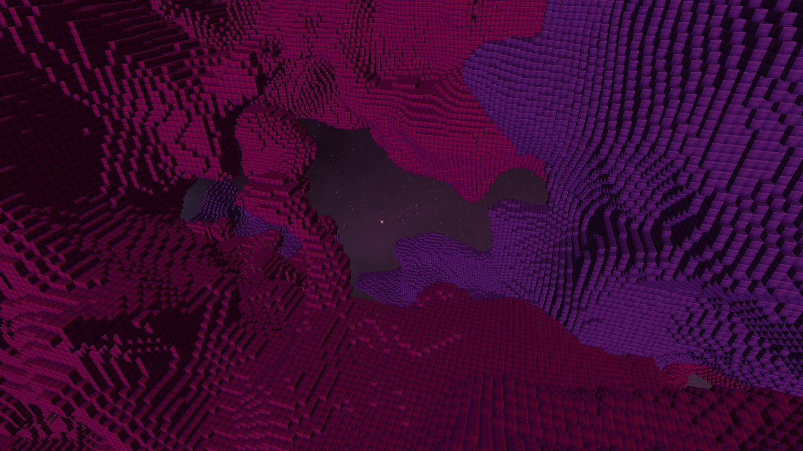

# Requirements
Project written in C++17 with glfw (OpenGL), requires you to have 
- glfw3
- glm

For the build process you will also need cmake.

# Description
The game is currently in a state where it is functional on the "main"-branch but possesses no tangible gameplay. The "chunk optimization"-branch has several code improvements but the GLSL shader code is faulty.

The world generates infinitely many chunks in all directions on demand. Player movement is possible. The terrain uses Perlin noise for its generation.

# TODO Lists
Lists of things that need to be done to bring this game up to basic performance and gameplay standards

## Gameplay
- [x] Dynamic chunk generation and deletion
- [x] More elaborate procedural generation of chunks (see Perlin noise)
- [ ] Removal and addition of blocks to the world
- [ ] Other entities to interact with (hostile/friendly)
- [x] New shaders
- [ ] Better 3D player navigation
- [x] Addition of new block textures
- [ ] Simple player UI

## Performance
- [ ] Freeing up VRAM by using more compact data types
- [ ] Different data structures for world composition

## Refactoring
- [x] Move some generic functions to util.cpp